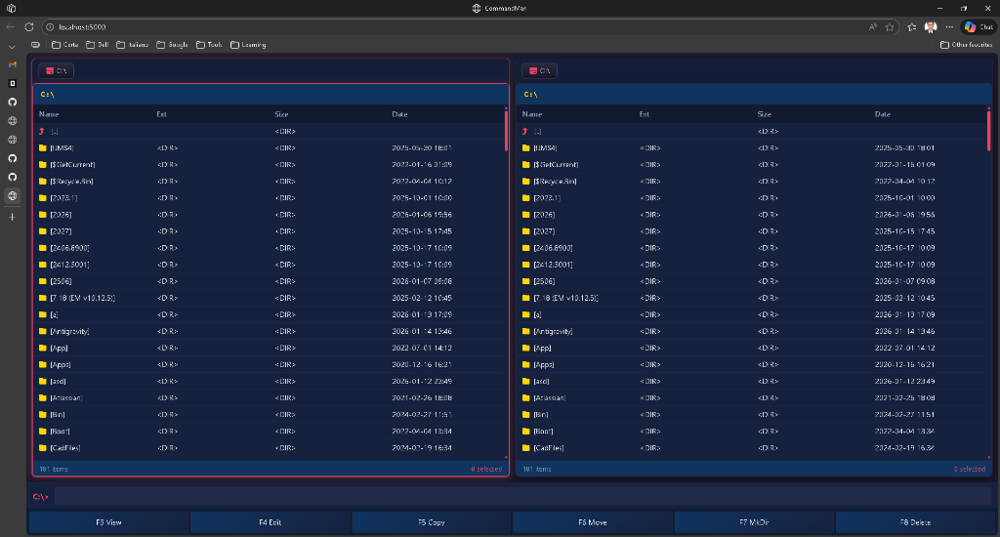

# CommandManBlazor

CommandManBlazor is a high-performance, dual-panel file manager featuring a sleek "Modern Neon" aesthetic. Built with Blazor Server and a lightweight WPF tray wrapper, it combines the efficiency of classic file managers with a beautiful, responsive web-based UI.

## Key Features

- **🚀 Dual-Panel Efficiency**: Manage files and directories in two independent, side-by-side panels.
- **✨ Modern Aesthetics**: Premium dark-mode UI with vibrant neon accents and glassmorphic elements.
- **⌨️ Keyboard-Centric**: Fully navigable via keyboard, supporting classic shortcuts (F3-F8, Tab, Enter, etc.).
- **📊 Real-time Feedback**: Live item and selection counts in the panel footers.
- **📥 Windows Integration**: Seamlessly launch from Windows File Explorer via a custom "Open with CommandMan" context menu.
- **💎 Tray Companion**: Runs as a lightweight system tray application for easy access and process management.

## Getting Started

### Prerequisites

- .NET 10.0 SDK

### Running from Source

1. Clone the repository.
2. Navigate to the `CommandMan.Web` directory.
3. Run `dotnet run`.
4. Open your browser at `http://localhost:5000`.

### Deployment and File Explorer Integration

For instructions on how to publish the application and add the "Open with CommandMan" context menu to Windows File Explorer, please refer to the [DEPLOYMENT.md](file:///c:/CommandManBlazor/CommandManBlazor/DEPLOYMENT.md) guide.

## License

[Add License Information Here]
